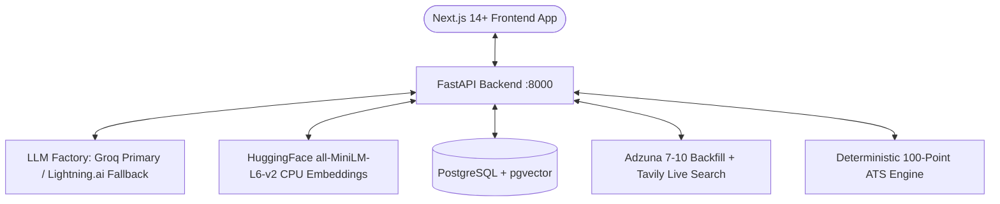

# 🚀 Career Copilot — Multi-Agent AI Career Strategy & Job Search Engine

Career Copilot is an end-to-end autonomous multi-agent platform designed to automate the technical job search lifecycle. It features deterministic ATS scoring, real-time market intelligence with dynamic backfill pagination, anti-hallucination resume tailoring with automated critic validation, stateful mock interviews with STAR rubric grading, and feasibility-budgeted career learning roadmaps.

---

## 🌟 Core Features

* **📄 CV Analysis & ATS Readiness:**
  * Multi-format parsing (PDF, DOCX, and scanned document OCR fallback via `pytesseract`).
  * Enforces a strict **Single Active CV Policy** (automatically cleans up previous files and vectors).
  * Deterministic **100-Point General ATS Audit** across 4 categories: *Contact & Sections*, *Action Verbs*, *Quantifiable Impact*, and *Formatting & Skill Density*.
* **🔎 Dual-Layer Market Research & Job Matcher:**
  * Adzuna API integration with **Dynamic Backfill Pagination** (guarantees 7–10 distinct jobs per query).
  * **Tavily Live Web Search Fallback:** Automatically fetches live listings from LinkedIn, Wuzzuf, Bayt, and Glassdoor for regions without a dedicated Adzuna index (e.g. Egypt, MENA).
  * Cross-source **SHA-256 Content Hash Deduplication**.
  * Hybrid fit ranking sorting jobs by candidate match percentage.
* **✍️ Application Studio (Fact-Checked Tailoring):**
  * Tailors resume bullet points, personalizes cover letters, and generates 3-paragraph cold outreach emails.
  * **Fact & Anti-Hallucination Critic Loop:** Validates generated content against the original CV (up to 3 attempts), rejecting unverified skills or claims.
  * Before vs. After ATS match score delta.
  * One-click export to Microsoft Word (`.docx`) and clean HTML/PDF.
* **📊 Mini-CRM Kanban Board:**
  * Complete application lifecycle tracking (*Saved*, *Tailored*, *Applied*, *Interviewing*, *Offered*, *Rejected*).
* **🎙️ Mock Interview Simulator:**
  * Multi-turn interview simulation in *General*, *Technical*, or *Behavioral* modes.
  * Real-time per-turn micro-feedback.
  * Comprehensive final evaluation scorecard with STAR rubric analysis and hiring recommendation.
* **🗺️ Career Roadmap Planner:**
  * Input Gate: requires *Target Role*, *Timeframe*, and *Weekly Study Hours*.
  * Tavily real-time market skill trends integration.
  * **Feasibility Critic Loop:** Verifies workload budgeting ($Weeks \times Hours/Week$) and milestone sequencing.

---

## 🛠️ Architecture & Tech Stack



* **Backend:** Python 3.12, FastAPI, SQLAlchemy 2.0, Pydantic v2, `uv` package manager.
* **LLM Engine:** Groq primary (`openai/gpt-oss-120b`, `openai/gpt-oss-20b`) with automatic fallback to Lightning.ai (`openai/gpt-oss-120b`).
* **Embeddings:** Free local CPU HuggingFace `sentence-transformers/all-MiniLM-L6-v2` (384 dimensions, zero API cost, AWS Free Tier compatible).
* **Database & Vector Store:** PostgreSQL 16 with `pgvector` extension.
* **Frontend:** Next.js 14+ (App Router), React 19, TypeScript, TailwindCSS, Lucide Icons, `next-themes` (Light/Dark/System modes).

---

## 🏁 Quickstart Guide

### Prerequisites
* Python 3.12+ and [`uv`](https://docs.astral.sh/uv/)
* Node.js 18+ and `npm`
* Docker & Docker Compose (for PostgreSQL)

---

### Step 1: Clone & Configure Environment

```powershell
# Copy example environment configuration
cp .env.example .env
```

Open `.env` and configure your API keys:
* `GROQ_API_KEY`: Groq API Key ([https://console.groq.com/](https://console.groq.com/))
* `LIGHTNING_API_KEY`: Lightning.ai API Key (Optional fallback)
* `ADZUNA_APP_ID` & `ADZUNA_API_KEY`: Adzuna Developer Credentials ([https://developer.adzuna.com/](https://developer.adzuna.com/))
* `TAVILY_API_KEY`: Tavily Search API Key ([https://tavily.com/](https://tavily.com/))
* `SECRET_KEY`: Cryptographically secure 256-bit string for JWT authentication.

---

### Step 2: Start PostgreSQL with `pgvector`

```powershell
docker compose up -d
```

---

### Step 3: Start the Backend API (FastAPI)

```powershell
# Install backend dependencies with uv
uv sync

# Run the FastAPI development server
uv run uvicorn backend.app.main:app --reload --port 8000
```
* **API URL:** `http://localhost:8000`
* **Swagger Interactive Docs:** `http://localhost:8000/docs`

---

### Step 4: Start the Frontend Web App (Next.js)

In a second terminal window:
```powershell
cd frontend
npm install
npm run dev
```
* **Web App URL:** `http://localhost:3000`

---

## 🧪 Running Automated Tests

Run the full pytest suite (unit tests, parsing, ATS formulas, Adzuna backfill, and real CV audits):

```powershell
uv run pytest
```

---

## 📚 Project Documentation

* [Implementation Plan](docs/implementation_plan.md) — Comprehensive architecture blueprint and agent design.
* [Deployment Plan](docs/deployment_plan.md) — AWS Free-Tier CloudFormation template, ALB, and CI/CD guide.
* [Architecture Flowcharts](docs/architecture_flowcharts.md) — 10 Mermaid flowcharts covering all agent states and use cases.
* [Database Schema](docs/database_schema.md) — PostgreSQL ERD and DDL table definitions with `pgvector`.
