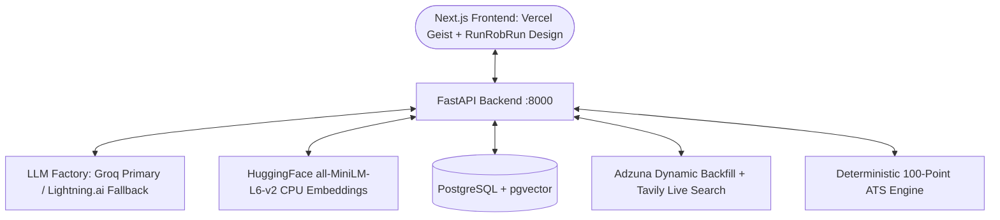

# 🚀 Career Copilot — Multi-Agent AI Career Strategy & Job Search Engine

Career Copilot is an end-to-end autonomous multi-agent platform designed to automate the technical career lifecycle. It features deterministic ATS scoring, real-time market intelligence with dynamic backfill pagination, anti-hallucination resume tailoring with automated critic validation, stateful mock interviews with STAR rubric grading, and feasibility-budgeted career learning roadmaps.

---

## 🌟 Core Features & Multi-Agent Capabilities

### 📄 1. CV Analysis & Deterministic ATS Audit
* **Multi-Format Ingestion:** Native parsing for PDF and DOCX, plus automated OCR fallback via `pytesseract` for scanned or image-only documents ($<50$ extracted characters).
* **Single Active CV Policy:** Uploading or pasting a new resume automatically purges previous disk files and overwrites database vector embeddings.
* **Deterministic 100-Point ATS Engine:**
  1. *Contact & Section Hygiene (25 pts):* Full contact info, standard header verification.
  2. *Action Verb Strength (25 pts):* Quantifies leading power verbs in bullet points.
  3. *Quantifiable Impact (25 pts):* Analyzes metrics, currency, percentages, and multipliers.
  4. *Formatting & Skill Density (25 pts):* Evaluates bullet length, word counts, and technical skill breadth.
* **Live Architectural Loading Screen:** Real-time feedback with pulsating radar and scanning tickers.

### 🔎 2. Dual-Layer Market Research & 3-Factor Job Matcher
* **Adzuna Dynamic Backfill Pagination:** Guarantees 7–10 distinct job listings per query via automated page offset pagination.
* **Universal Location Fallback (Egypt & Global):** If Adzuna lacks coverage in specific markets, Tavily live web search queries LinkedIn, Wuzzuf, Bayt, and Glassdoor.
* **Cross-Source SHA-256 Deduplication:** Computes normalized `sha256(company|title|location)` to discard duplicate postings across search providers.
* **Exact 3-Factor Hybrid Matching Formula:**
  $$\text{Total Match Score} = (0.50 \times \text{Skill Overlap}) + (0.30 \times \text{Vector Cosine}) + (0.20 \times \text{Experience Alignment})$$

### 🏢 3. On-Demand & Auto-Cached Company Intelligence
* **PostgreSQL Fast Cache:** Retrieves company dossiers in $<5\text{ms}$ with zero Tavily calls if already queried.
* **Auto-Fetch on Demand:** If not pre-cached, the system automatically fetches company summary, culture values, and tech stack from Tavily and stores it in the database for instant reuse across all agents.

### ✍️ 4. Application Studio (Fact-Checked Full CV Tailoring & Document Exports)
* **Full Resume Integrity:** Preserves contact information, education, and certifications while selectively tailoring the professional summary, emphasized skills, and experience bullets to target JD requirements.
* **Personalized Cover Letter & Cold Outreach Email:** Tailored to the company culture and hiring manager.
* **Fact & Anti-Hallucination Critic Loop:** Validates generated content against the candidate's original CV (up to 3 reflection attempts), rejecting unverified skills or invented claims.
* **Document Exports:**
  * Tailored Resume: Microsoft Word (`.docx`) and Semantic HTML (`/export/html`).
  * Cover Letter: Microsoft Word (`.docx`).
  * Cold Outreach Email: Plain Text (`.txt`).

### 📊 5. 6-Stage Mini-CRM Kanban Pipeline
* **Full Lifecycle Tracking:** `Saved`, `Tailored`, `Applied`, `Interviewing`, `Offered`, and `Rejected`.
* **Integrated Modal Inspection:** Inspect job details, trigger the **Application Agent** on untailored opportunities with one click, and download previously exported assets.

### 🎙️ 6. Stateful Mock Interview Simulator
* **Configurable Interview Protocols:**
  * *General Mode:* Custom target domain/field input (e.g. *Machine Learning*, *Cloud Architecture*).
  * *Technical Mode:* Probes technical architecture and engineering tradeoffs strictly against selected Mini-CRM opportunities, active CV, and company tech culture.
  * *Behavioral Mode:* Rigorously evaluates candidate responses against the STAR framework (Situation, Task, Action, Result) using target job requirements, company culture values, and active CV.
* **Real-Time Micro-Feedback:** Immediate constructive feedback and STAR grading per turn.
* **Scorecard & Session Lifecycle:** Comprehensive final evaluation scorecard with hiring recommendations, graceful zero-turn handling, input locking, and a dedicated **Exit Interview / New Session** workflow.

### 🗺️ 7. Conversational Career Roadmap Planner
* **Input Gate:** Validates *Target Role*, *Timeframe*, and *Weekly Study Hours*.
* **Real-time Market Trends:** Tavily integration for trending frameworks and tools.
* **Feasibility Critic Loop:** Budgets learning pace against available hours ($Weeks \times Hours/Week$) to prevent overambitious burnout.

---

## 🛠️ Architecture & Tech Stack



* **Backend:** Python 3.12, FastAPI, SQLAlchemy 2.0, Pydantic v2, `uv` package manager.
* **LLM Engine:** Groq primary (`openai/gpt-oss-120b`, `openai/gpt-oss-20b`) with automatic failover to Lightning.ai (`lightning-ai/gpt-oss-120b`) via LangChain `.with_fallbacks()`.
* **Embeddings:** Free local CPU HuggingFace `sentence-transformers/all-MiniLM-L6-v2` (`Vector(384)`, zero API cost, AWS Free Tier compatible).
* **Database & Vector Store:** PostgreSQL 16 with `pgvector` extension.
* **Frontend:** Next.js 16 (App Router), React 19, TypeScript, TailwindCSS, Vercel Geist typography, Run Rob Run architectural aesthetic with tactical corner crosses, and `next-themes` (Light/Dark/System modes).

---

## 🏁 Quickstart Guide

### Prerequisites
* Python 3.12+ and [`uv`](https://docs.astral.sh/uv/)
* Node.js 18+ and `npm`
* Docker & Docker Compose (for PostgreSQL with `pgvector`)

---

### Step 1: Clone & Configure Environment

```powershell
# Copy example environment configuration
cp .env.example .env
```

Configure API keys in `.env`:
* `GROQ_API_KEY`: Groq API Key ([https://console.groq.com/](https://console.groq.com/))
* `LIGHTNING_API_KEY`: Lightning.ai API Key (Optional fallback)
* `ADZUNA_APP_ID` & `ADZUNA_API_KEY`: Adzuna Developer Credentials ([https://developer.adzuna.com/](https://developer.adzuna.com/))
* `TAVILY_API_KEY`: Tavily Search API Key ([https://tavily.com/](https://tavily.com/))
* `SECRET_KEY`: Cryptographically secure string for JWT authentication.

---

### Step 2: Start PostgreSQL with `pgvector`

```powershell
docker compose up -d
```

---

### Step 3: Start the Backend API (FastAPI)

```powershell
# Install backend dependencies with uv
uv sync

# Run the FastAPI server
uv run uvicorn backend.app.main:app --reload --port 8000
```
* **API URL:** `http://localhost:8000`
* **Swagger Interactive Docs:** `http://localhost:8000/docs`

---

### Step 4: Start the Frontend App (Next.js)

```powershell
cd frontend
npm install
npm run dev
```
* **Web App URL:** `http://localhost:3000`

---

## 🧪 Automated Testing

Run the full backend test suite:

```powershell
uv run pytest
```
* `test_job_content_hash_consistency`: **PASSED**
* `test_dynamic_backfill_pagination_mock`: **PASSED**
* `test_general_ats_score_high_quality_cv`: **PASSED**
* `test_general_ats_score_missing_contact_and_weak_verbs`: **PASSED**
* `test_job_specific_ats_match`: **PASSED**
* `test_sanitize_text`: **PASSED**
* `test_parse_plain_text_cv`: **PASSED**
* `test_real_cv_parsing_pdf`: **PASSED**
* `test_real_cv_parsing_docx`: **PASSED**
* `test_full_ats_audit_on_real_cv`: **PASSED**
