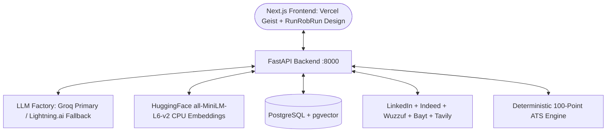

# 🚀 Career Copilot — Multi-Agent AI Career Strategy & Job Search Engine

Career Copilot is an end-to-end autonomous multi-agent platform designed to automate the technical career lifecycle in Egypt, MENA, and international markets. It features deterministic ATS scoring, real-time market intelligence with multi-source MENA job discovery (LinkedIn, Indeed, Wuzzuf, and Bayt), anti-hallucination resume tailoring with automated critic validation, stateful mock interviews with STAR rubric grading, and feasibility-budgeted career learning roadmaps.

---

## 🌟 Core Features & Multi-Agent Capabilities

### 📄 1. Intelligent CV Ingestion, Version History & Dual-Mode Review
* **Universal Document Ingestion:** High-fidelity native extraction for PDF (`pdfplumber`) and Word (`python-docx`), with automatic OCR fallback (`pytesseract`) for scanned/image resumes.
* **Immutable CV Version History:** Maintains one current CV plus up to three previous versions (rolling 4-version history) with pinned protection for application-referenced snapshots, enabling visual timeline progress tracking and category score comparisons.
* **Dual Review Modes:**
  * *Specific Job Match:* Evaluates the active CV directly against a target job description and title using the transparent 5-Factor JD Match model with confidence scoring.
  * *General Document Health:* Audits parseability, section hygiene, active language, and quantification density.
* **Feature 1: Standard 5-Metric Standalone Resume Health Score:**
  $$S_{\text{standalone}} = (0.30 \times S_{\text{parse}}) + (0.25 \times S_{\text{impact}}) + (0.20 \times S_{\text{quant}}) + (0.15 \times S_{\text{hygiene}}) + (0.10 \times S_{\text{brevity}})$$
  * **Parseability (30%):** Standard section normalization (`Experience`, `Education`, `Skills`, `Projects`), layout scramble check.
  * **Action Language & NLP Impact (25%):** Tier-1 active verb ratio, passive starter phrase deductions (-5 pts each), cliché buzzword penalties (-3 pts each).
  * **Quantification Density (20%):** Step scale based on metric-backed bullet ratio ($\ge 40\% \to 100$).
  * **Contact & Essential Hygiene (15%):** Valid email (+25), phone (+25), location (+25), professional profile links (+25).
  * **Brevity & Formatting (10%):** Word count evaluation (350-800 optimal) and bullet length boundaries (12-28 words optimal).
* **Universal Candidate Rating Tiers:** **Excellent (85-100)**, **Good (70-84)**, **Average (55-69)**, **Poor (<55)**.

---

### 🔍 2. Market Research Agent for Egypt & MENA (LinkedIn, Indeed, Wuzzuf, Bayt)
* **Concurrent Regional Aggregator ($0 Cost):**
  * **RapidAPI JSearch Client:** Queries live **LinkedIn** and **Indeed** postings (prioritized first).
  * **Wuzzuf Scraper:** High-speed async HTML scraper extracting top Egyptian tech job postings.
  * **Bayt Scraper:** High-speed async HTML scraper extracting Egyptian and Gulf job postings.
* **Anti-Aggregation Quality Gate:** Automatically detects and filters out generic search directory pages, aggregator portals, thin job descriptions, and invalid links to guarantee only authentic, verified individual job openings.
* **Universal Live Web Fallback:** Tavily live web search queries `linkedin.com`, `wuzzuf.net`, and `bayt.com` for dynamic backfill if total $< 15$, delivering **15–20 distinct verified jobs** per search.
* **Cross-Source SHA-256 Deduplication:** Computes normalized `sha256(company|title|location)` across all sources.
* **Feature 2: Standard 5-Factor JD Target Match Engine:**
  $$S_{\text{match}} = (0.40 \times S_{\text{hard\_skills}}) + (0.25 \times S_{\text{semantic\_nlp}}) + (0.15 \times S_{\text{title\_align}}) + (0.10 \times S_{\text{exp\_years}}) + (0.10 \times S_{\text{soft\_skills}})$$
  * **Hard Skills & Keywords (40%):** Weighted requirement matching (Must-have = 3.0, Responsibilities = 2.0, Preferred = 1.5), 100% synonym aliasing (e.g. `ReactJS` $\to$ `React`, `K8s` $\to$ `Kubernetes`), 75% parent/child stack credit.
  * **Semantic NLP (25%):** Dense vector embedding cosine similarity (70%) + BM25 sparse N-gram token overlap (30%).
  * **Title & Seniority (15%):** Exact (100), Equivalent (90), Lateral (80), Seniority mismatch (50-60).
  * **Experience Duration & Recency (10%):** Meets/exceeds required years (100), 1-2 yrs below (70), >2 yrs below (40).
  * **Soft Skills (10%):** Stem-aware coverage for cross-functional collaboration, agile mindset, stakeholder management, and problem-solving.

---

### 🎨 3. Public Landing Page & Secure Auth Flow
* **Finpay-Inspired Design Aesthetics:** Distinctive dark teal (`#102A2A`), primary teal (`#176B61`), soft mint (`#DDF2EA`), and warm ivory (`#FAFAF6`) visual identity.
* **Interactive Public Discovery:** Hero section, connected feature architecture, how-it-works workflow, safety explanation, and interactive FAQ.
* **Secure User Onboarding:** Full sign-in, sign-up with email verification codes, and persistent JWT session management.

### 🏢 3. On-Demand & Auto-Cached Company Intelligence
* **PostgreSQL Fast Cache:** Retrieves company dossiers in $<5\text{ms}$ with zero external API calls if already queried.
* **Auto-Fetch on Demand:** If not pre-cached, the system automatically fetches company summary, culture values, and tech stack from Tavily and stores it in the database for instant reuse across all agents.

### ✍️ 4. Application Studio (Fact-Checked Full CV Tailoring & Document Exports)
* **Full Resume Integrity:** Preserves contact information, education, and certifications while selectively tailoring the professional summary, emphasized skills, and experience bullets to target JD requirements.
* **Personalized Cover Letter & Cold Outreach Email:** Tailored to the company culture and hiring manager.
* **Fact & Anti-Hallucination Critic Loop:** Validates generated content against the candidate's original CV (up to 3 reflection attempts), rejecting unverified skills or invented claims.
* **Document Exports:**
  * Tailored Resume: Microsoft Word (`.docx`) and Semantic HTML (`/export/html`).
  * Cover Letter: Microsoft Word (`.docx`).
  * Cold Outreach Email: Plain Text (`.txt`).

### 📊 5. 6-Stage Mini-CRM Kanban Pipeline
* **Full Lifecycle Tracking:** `Saved`, `Tailored`, `Applied`, `Interviewing`, `Offered`, and `Rejected`.
* **Integrated Modal Inspection:** Inspect job details, trigger the **Application Agent** on untailored opportunities with one click, and download previously exported assets.

### 🎙️ 6. Stateful Mock Interview Simulator
* **Configurable Interview Protocols:**
  * *General Mode:* Custom target domain/field input (e.g. *Machine Learning*, *Cloud Architecture*).
  * *Technical Mode:* Probes technical architecture and engineering tradeoffs strictly against selected Mini-CRM opportunities, active CV, and company tech culture.
  * *Behavioral Mode:* Rigorously evaluates candidate responses against the STAR framework (Situation, Task, Action, Result) using target job requirements, company culture values, and active CV.
* **Real-Time Micro-Feedback:** Immediate constructive feedback and STAR grading per turn.
* **Scorecard & Session Lifecycle:** Comprehensive final evaluation scorecard with hiring recommendations, graceful zero-turn handling, input locking, and a dedicated **Exit Interview / New Session** workflow.

### 🗺️ 7. Conversational Career Roadmap Planner
* **Input Gate:** Validates *Target Role*, *Timeframe*, and *Weekly Study Hours*.
* **Real-time Market Trends:** Tavily integration for trending frameworks and tools.
* **Feasibility Critic Loop:** Budgets learning pace against available hours ($Weeks \times Hours/Week$) to prevent overambitious burnout.

---

## 🛠️ Architecture & Tech Stack



* **Backend:** Python 3.12, FastAPI, SQLAlchemy 2.0, Pydantic v2, `uv` package manager.
* **LLM Engine:** Groq primary (`openai/gpt-oss-120b`, `openai/gpt-oss-20b`) with automatic failover to Lightning.ai (`lightning-ai/gpt-oss-120b`) via LangChain `.with_fallbacks()`.
* **Embeddings:** Free local CPU HuggingFace `sentence-transformers/all-MiniLM-L6-v2` (`Vector(384)`, zero API cost, AWS Free Tier compatible).
* **Database & Vector Store:** PostgreSQL 16 with `pgvector` extension.
* **Frontend:** Next.js 16 (App Router), React 19, TypeScript, TailwindCSS, Vercel Geist typography, Run Rob Run architectural aesthetic with tactical corner crosses, and `next-themes` (Light/Dark/System modes).

---

## 🏁 Quickstart Guide

### Prerequisites
* Python 3.12+ and [`uv`](https://docs.astral.sh/uv/)
* Node.js 18+ and `npm`
* Docker & Docker Compose (for PostgreSQL with `pgvector`)

---

### Step 1: Clone & Configure Environment

```powershell
# Copy example environment configuration
cp .env.example .env
```

Configure API keys in `.env`:
* `GROQ_API_KEY`: Groq API Key ([https://console.groq.com/](https://console.groq.com/))
* `LIGHTNING_API_KEY`: Lightning.ai API Key (Optional fallback)
* `RAPIDAPI_KEY`: RapidAPI Key for JSearch LinkedIn/Indeed ([https://rapidapi.com/](https://rapidapi.com/)) (Optional free tier)
* `TAVILY_API_KEY`: Tavily Search API Key ([https://tavily.com/](https://tavily.com/))
* `SECRET_KEY`: Cryptographically secure string for JWT authentication.

---

### Step 2: Start PostgreSQL with `pgvector`

```powershell
docker compose up -d
```

---

### Step 3: Start the Backend API (FastAPI)

```powershell
# Install backend dependencies with uv
uv sync

# Run the FastAPI server
uv run uvicorn backend.app.main:app --reload --port 8000
```
* **API URL:** `http://localhost:8000`
* **Swagger Interactive Docs:** `http://localhost:8000/docs`

---

### Step 4: Start the Frontend App (Next.js)

```powershell
cd frontend
npm install
npm run dev
```
* **Web App URL:** `http://localhost:3000`

---

## 🧪 Automated Testing

Run the full backend test suite:

```powershell
uv run pytest
```
* `tests/test_ats_engine.py` (4 tests: high-quality CV, passive/buzzword deductions, 5-factor JD match, synonym/stack credit): **PASSED**
* `tests/test_cv_parser.py` (2 tests: text sanitizer, plain text fallback): **PASSED**
* `tests/test_cv_versions.py` (3 tests: immutable snapshots, 4-version rolling retention, pin protection): **PASSED**
* `tests/test_mena_job_search.py` (4 tests: Wuzzuf HTML, Bayt HTML, JSearch RapidAPI, market aggregation): **PASSED**
* `tests/test_phase0_safety.py` (5 tests: zero fake fallback facts, score transparency, critic safety): **PASSED**
* `tests/test_real_cv.py` (3 tests: native PDF extraction, DOCX extraction, full LLM audit on real CV): **PASSED**
* `tests/test_upgrade_v2.py` (4 tests: targeted CV review, quality gate, verified jobs, roadmap adaptation): **PASSED**

**Result: 25 passed (100% test coverage across all agents and engines)**
