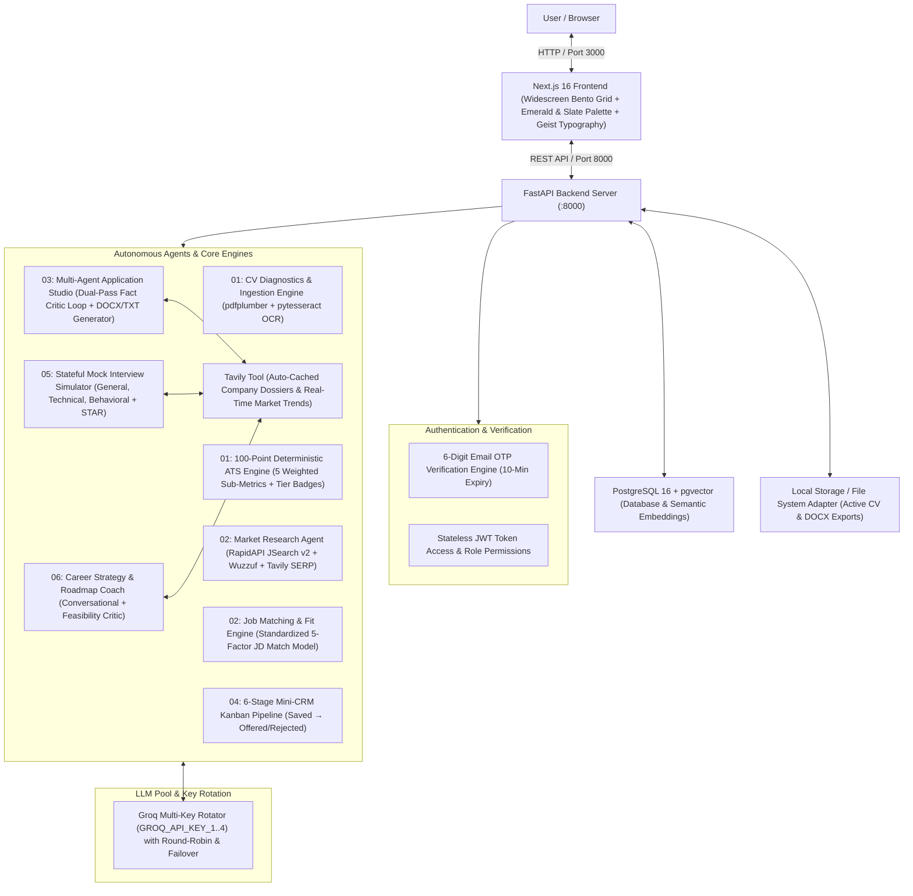
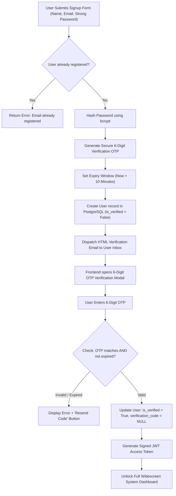
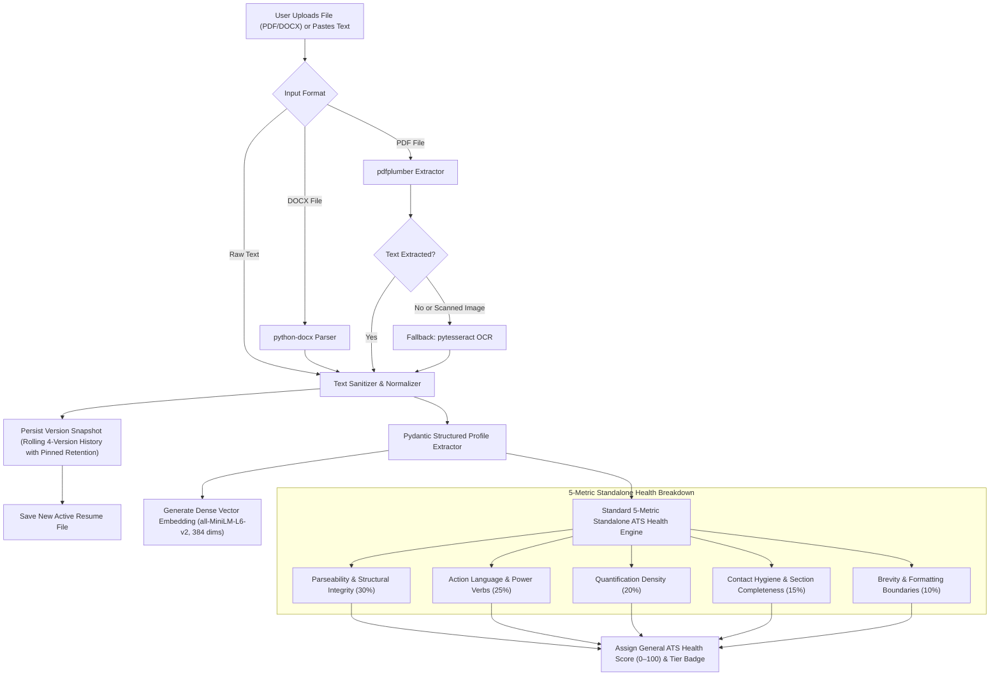
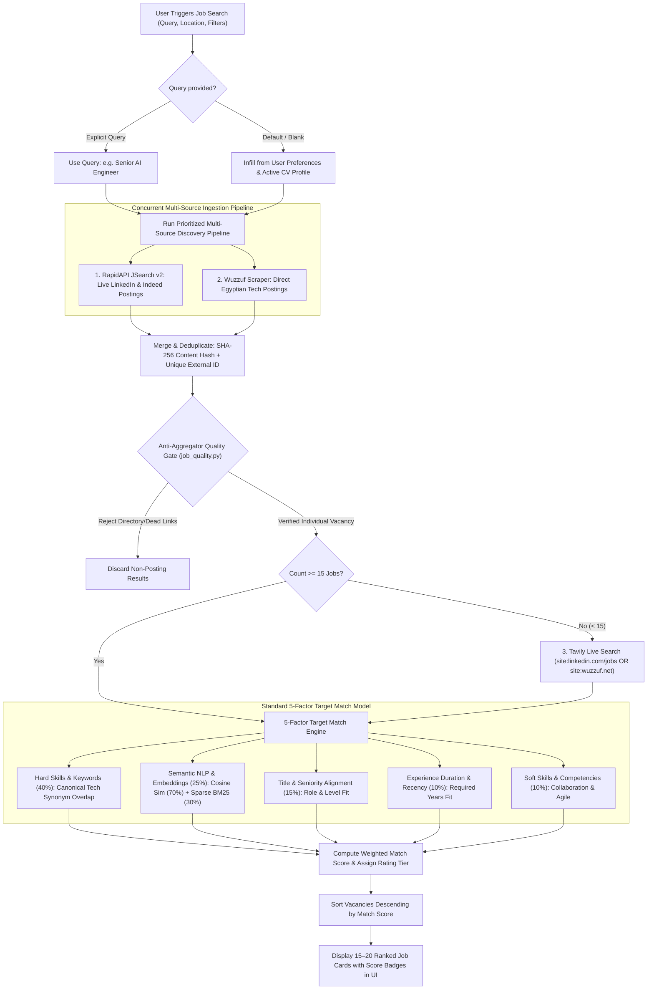
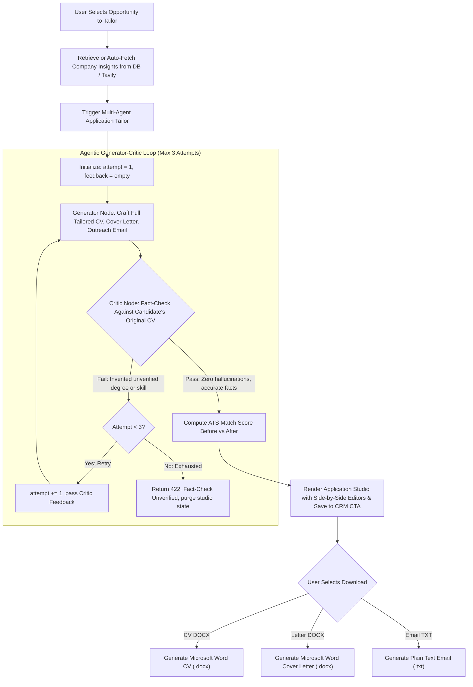
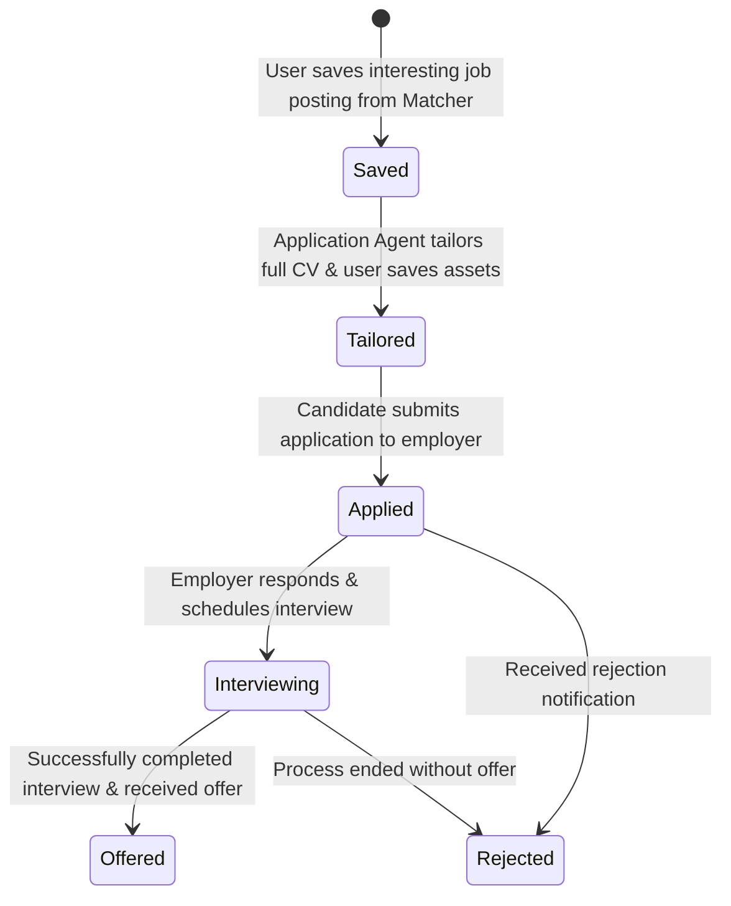
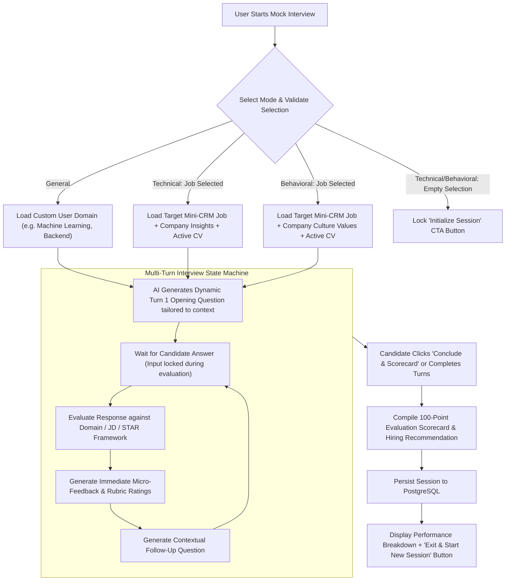
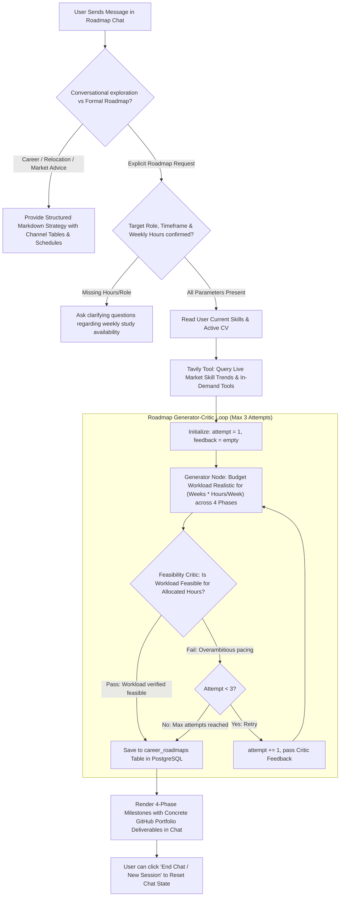

# Career Copilot: Architecture & Agent Flowcharts

Comprehensive reference document containing the global architecture and end-to-end workflow flowcharts for all agents, security modules, and user flows in **Career Copilot**.

---

## 1. Global System Architecture

---

## 2. Authentication & Email Verification Lifecycle

---

## 3. Agent Use-Case Flowcharts

---

### Module 01: CV Diagnostics, Deterministic ATS Scoring & Version Snapshots

---

### Module 02: Market Research & 5-Factor Job Matching

---

### Module 03: Application Tailoring Studio & Fact Critic Reflection Loop

---

### Module 04: 6-Stage Mini-CRM Pipeline Lifecycle

---

### Module 05: Stateful Mock Interview Multi-Turn Simulator

---

### Module 06: Conversational Career Roadmap Coach with Feasibility Critic

