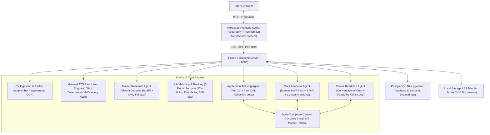
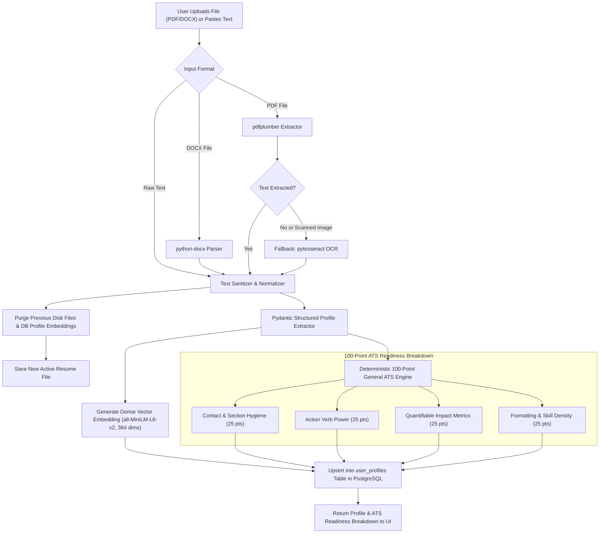
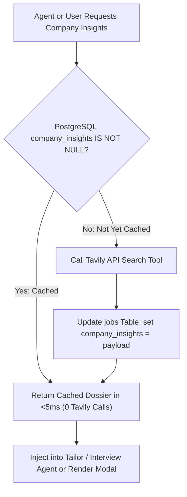
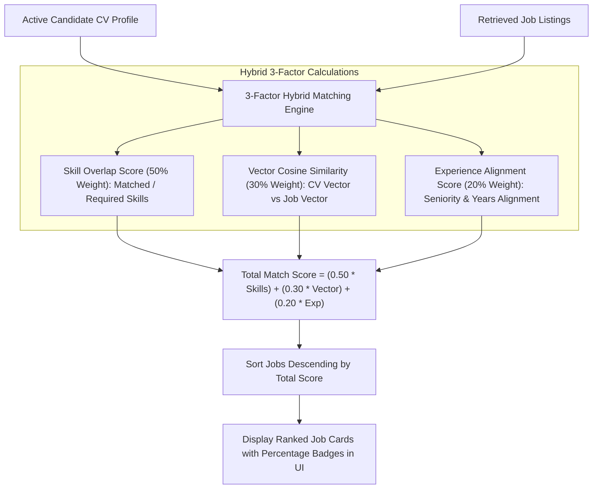
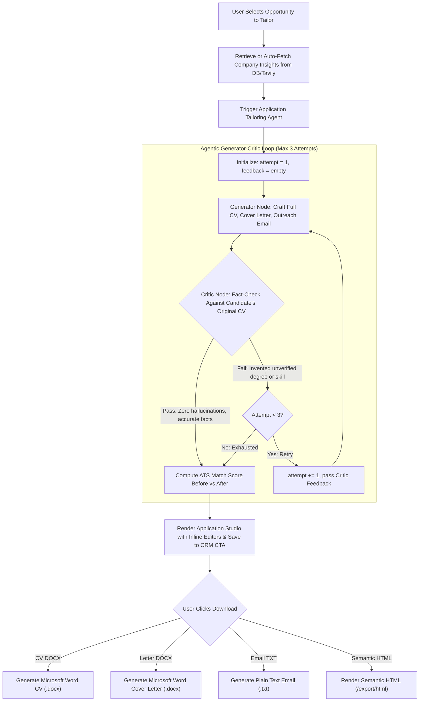
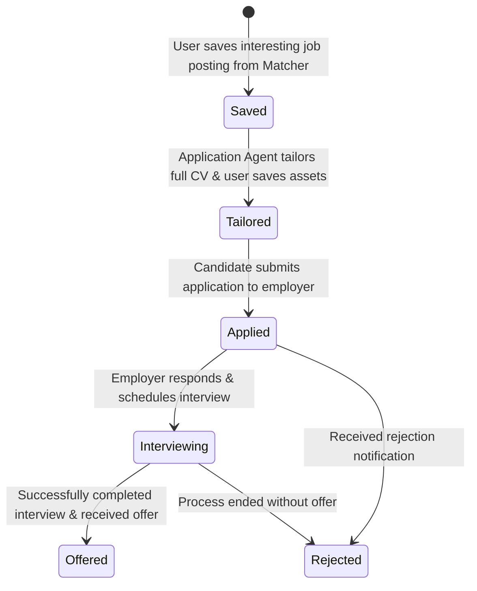
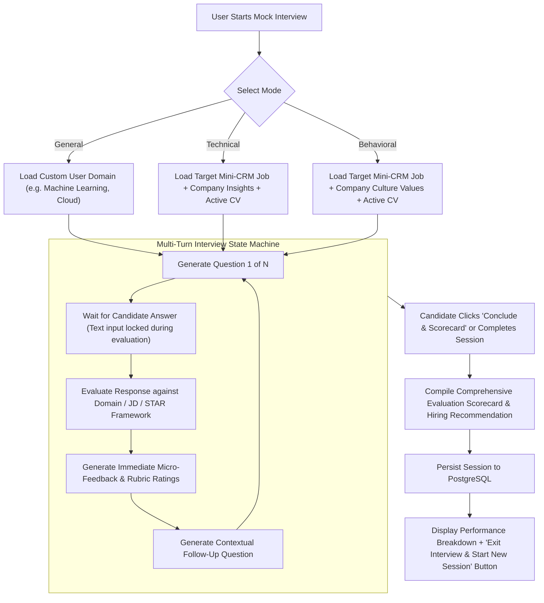
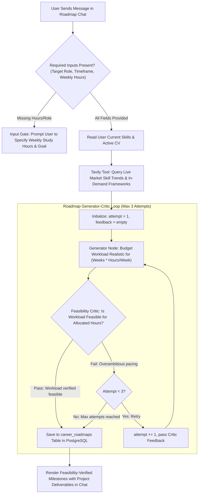

# Career Copilot: Architecture & Agent Flowcharts

Standalone reference document containing the global architecture and complete workflow flowcharts for all agents and use cases in **Career Copilot**.

---

## 1. Global System Architecture



---

## 2. Agent Use-Case Flowcharts

---

### Use Case 1: CV Ingestion, Deterministic ATS Audit & Single Active CV Policy



---

### Use Case 2: Market Research Agent for Egypt & MENA (LinkedIn, Indeed, Wuzzuf, Bayt)

```mermaid
flowchart TD
    UserQuery["User Search Query"] --> CheckInput{"Did user specify explicit criteria?"}
    
    CheckInput -->|Explicit Query| UseExplicit["Extract explicit Role, Location, Skills"]
    CheckInput -->|General Query| Infill["Infill from User Preferences & Active CV Profile"]
    
    UseExplicit & Infill --> RunConcurrent["Run Concurrent Multi-Source Ingestion Pipeline"]
    
    subgraph MENAPipeline ["Concurrent Egypt & MENA Ingestion Pipeline ($0 Cost)"]
        RunConcurrent --> Wuzzuf["Wuzzuf Scraper: Direct Egyptian Tech Postings"]
        RunConcurrent --> Bayt["Bayt Scraper: Egypt & Gulf Postings"]
        RunConcurrent --> JSearch["RapidAPI JSearch: Live LinkedIn & Indeed Postings"]
    end
    
    Wuzzuf & Bayt & JSearch --> Merge["Merge & Deduplicate: SHA-256 Content Hash + ID Check"]
    
    Merge --> CheckCount{"Count >= 7 Jobs?"}
    CheckCount -->|Yes| StoreNewJobs["Upsert Delivered Jobs into jobs Table"]
    CheckCount -->|No (< 7)| TavilyFallback["Tavily Live Web Search (site:linkedin.com OR site:wuzzuf.net)"] --> StoreNewJobs
    
    StoreNewJobs --> ReturnJobs["Return 7 to 10 Distinct Job Cards with Source Badges to UI"]
```

---

### Use Case 3: On-Demand & Auto-Cached Company Intelligence



---

### Use Case 4: 3-Factor Hybrid Matching & Ranking Engine



---

### Use Case 5: Application Tailoring with Fact Critic Reflection Loop & Document Exports



---

### Use Case 6: 6-Stage Mini-CRM Pipeline Lifecycle



---

### Use Case 7: Stateful Mock Interview Multi-Turn Simulator



---

### Use Case 8: Conversational Career Roadmap Planner with Feasibility Critic


