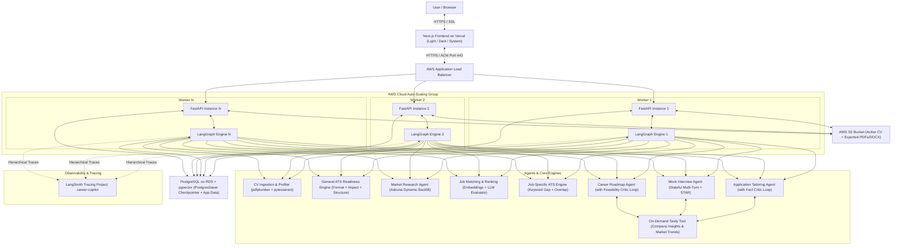
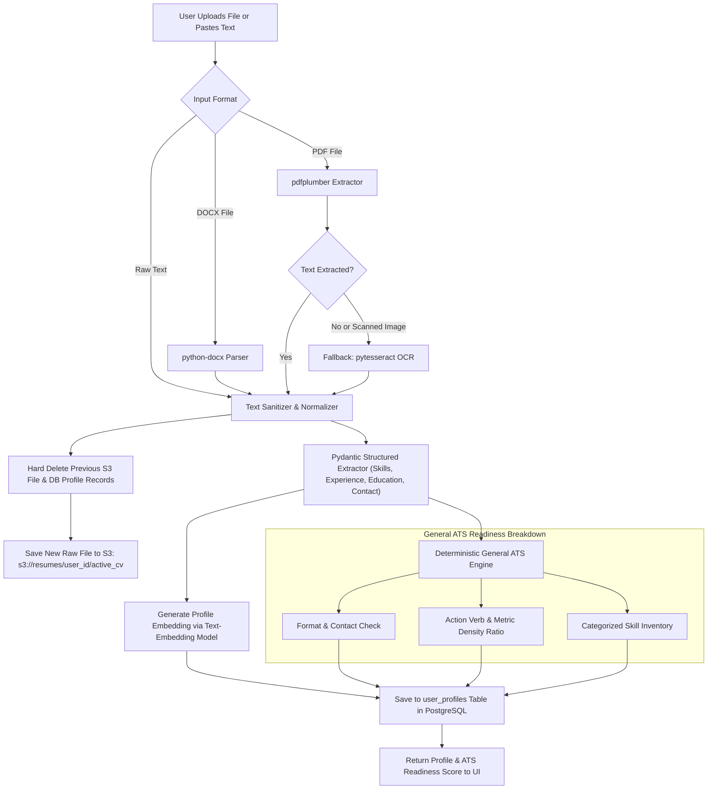
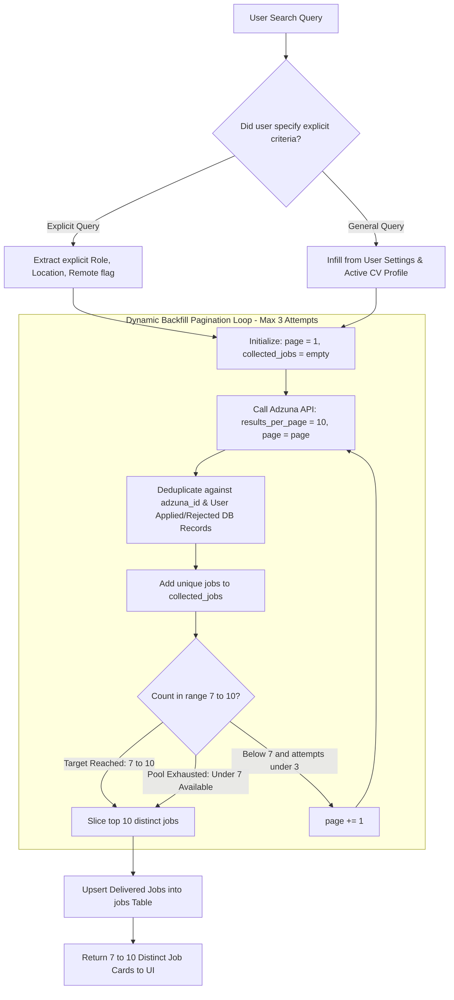
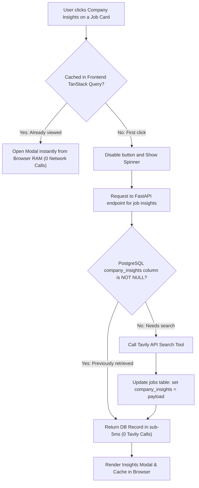
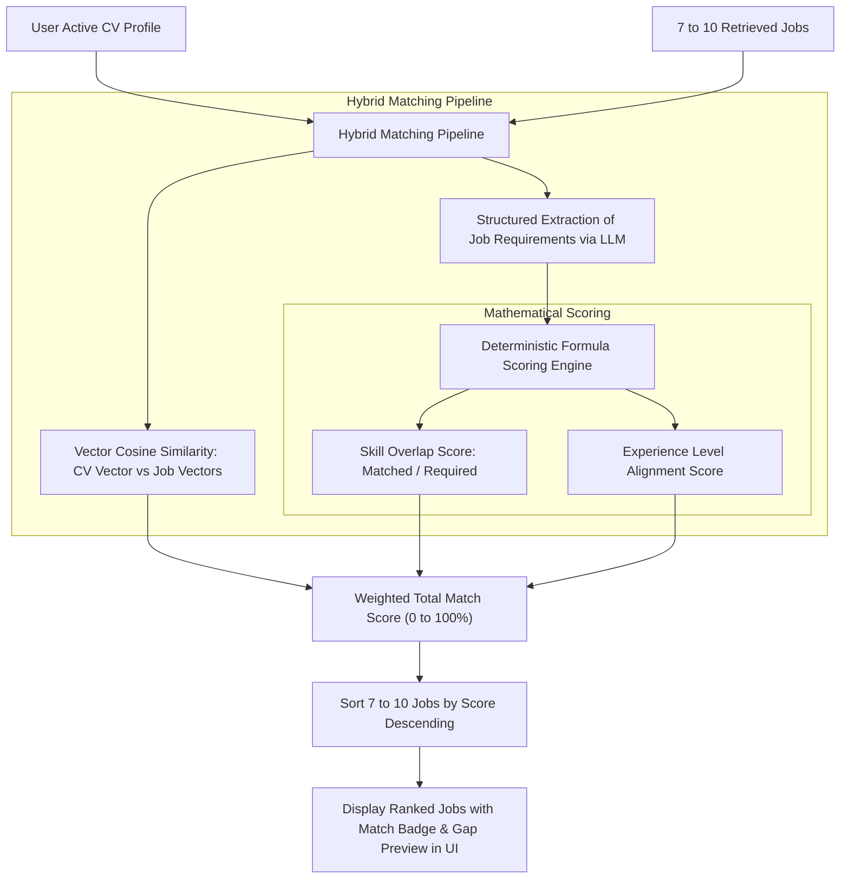
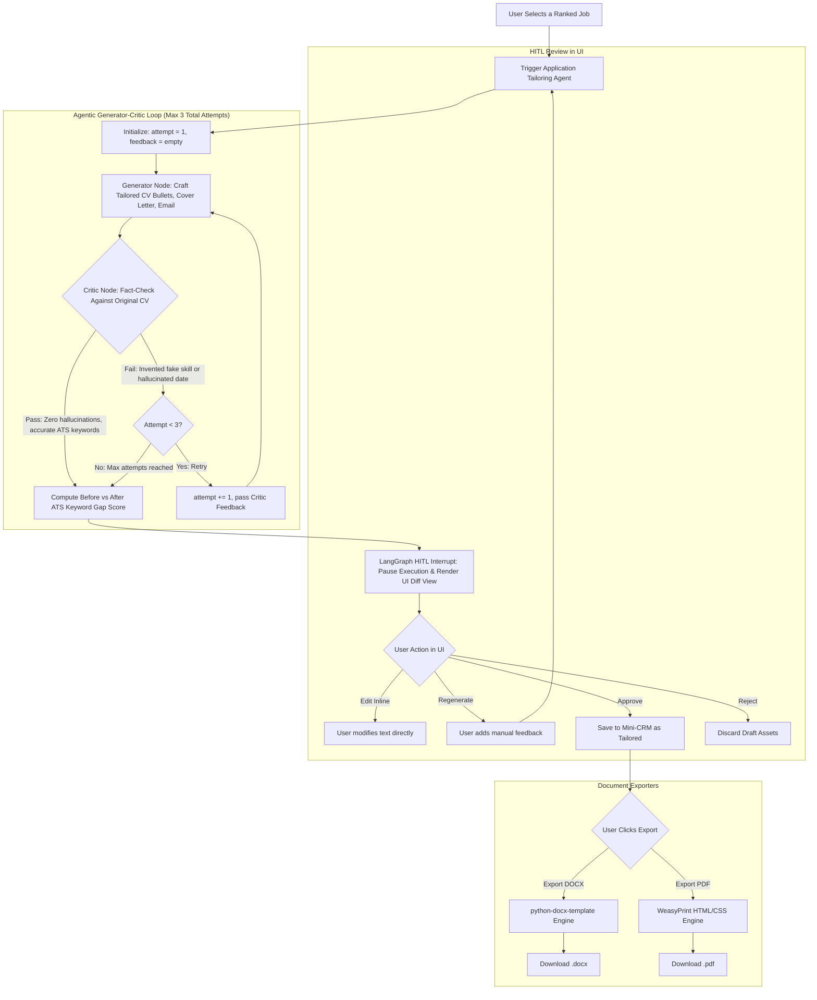
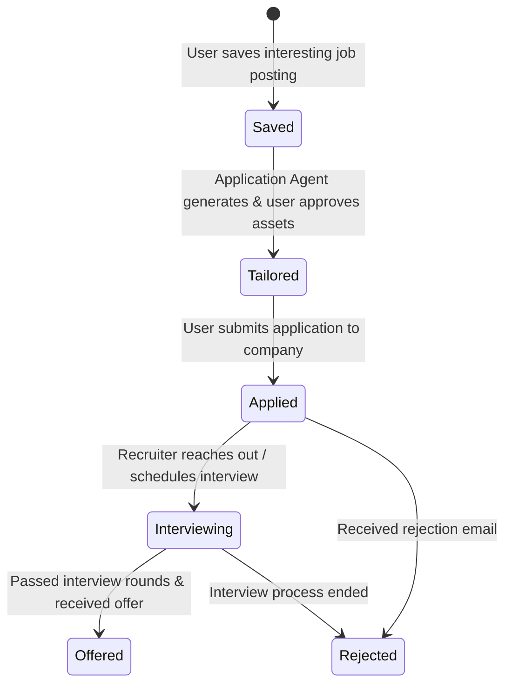
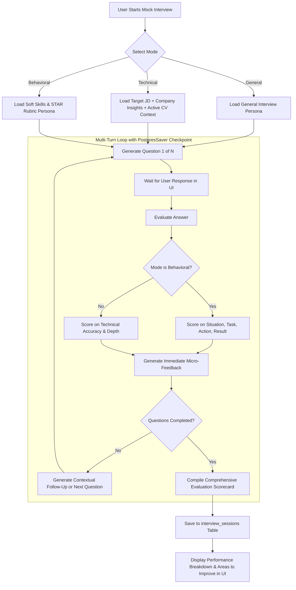
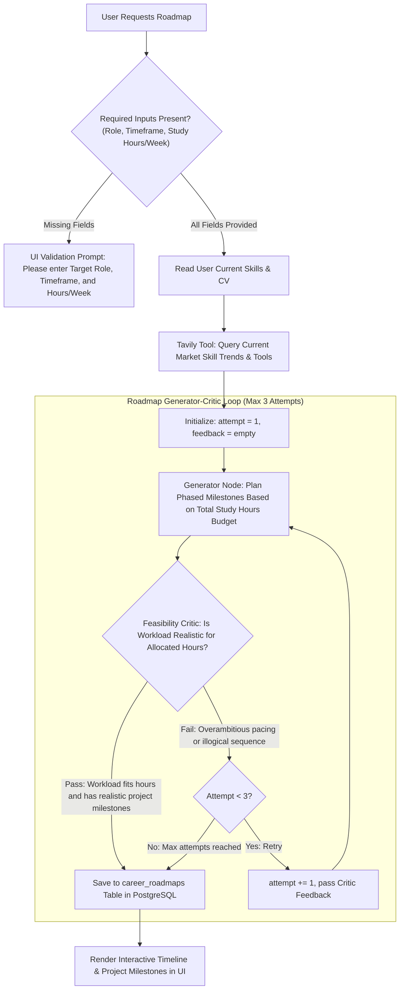

# Career Copilot: Architecture & Agent Flowcharts

Standalone reference document containing the global architecture and complete workflow flowcharts for all agents and use cases in **Career Copilot**.

---

## 1. Global System Architecture

---

## 2. LangSmith Observability & Tracing Hierarchy

```mermaid
flowchart TD
    Root["Project: career-copilot"] --> Trace1["Trace: cv_analysis_pipeline"]
    Root --> Trace2["Trace: market_research_agent"]
    Root --> Trace3["Trace: job_matching_ranking"]
    Root --> Trace4["Trace: application_tailoring_pipeline"]
    Root --> Trace5["Trace: mock_interview_session"]
    Root --> Trace6["Trace: career_roadmap_agent"]

    subgraph CV_Traces ["cv_analysis_pipeline spans"]
        Trace1 --> S1_1["span: document_text_extraction"]
        Trace1 --> S1_2["span: pydantic_schema_extraction"]
        Trace1 --> S1_3["span: deterministic_general_ats_scoring"]
        Trace1 --> S1_4["span: pgvector_profile_embedding"]
    end

    subgraph MR_Traces ["market_research_agent spans"]
        Trace2 --> S2_1["span: query_intent_infilling"]
        Trace2 --> S2_2["span: adzuna_pagination_backfill_loop"]
        Trace2 --> S2_3["span: deduplication_and_filtering"]
    end

    subgraph App_Traces ["application_tailoring_pipeline spans"]
        Trace4 --> S4_1["span: cached_or_tavily_company_research"]
        Trace4 --> S4_2["span: ats_experience_rephrasing"]
        Trace4 --> S4_3["span: cover_letter_generation"]
        Trace4 --> S4_4["span: critic_fact_validation_node"]
        Trace4 --> S4_5["span: hitl_interrupt_and_resume"]
    end

    subgraph Interview_Traces ["mock_interview_session spans"]
        Trace5 --> S5_1["span: turn_n_question_generation"]
        Trace5 --> S5_2["span: answer_evaluation_star_rubric"]
        Trace5 --> S5_3["span: micro_feedback_generation"]
        Trace5 --> S5_4["span: final_scorecard_compilation"]
    end

    subgraph Roadmap_Traces ["career_roadmap_agent spans"]
        Trace6 --> S6_1["span: input_completeness_validation"]
        Trace6 --> S6_2["span: market_trends_retrieval"]
        Trace6 --> S6_3["span: milestone_generation_by_hours"]
        Trace6 --> S6_4["span: feasibility_critic_node"]
    end
```

---

## 3. Agent Use-Case Flowcharts

---

### Use Case 1: CV Ingestion, General ATS Readiness & Single Active CV

---

### Use Case 2: Market Research Agent with Dynamic Backfill Pagination

---

### Use Case 3: On-Demand Company Insights Caching & Debouncing

---

### Use Case 4: Job Matching & Ranking Engine

---

### Use Case 5: Application Tailoring with Fact Critic Reflection Loop

---

### Use Case 6: Mini-CRM Application Tracking Lifecycle

---

### Use Case 7: Mock Interview Multi-Turn State Machine

---

### Use Case 8: Market-Aware Career Roadmap with Hours Validation & Feasibility Critic

