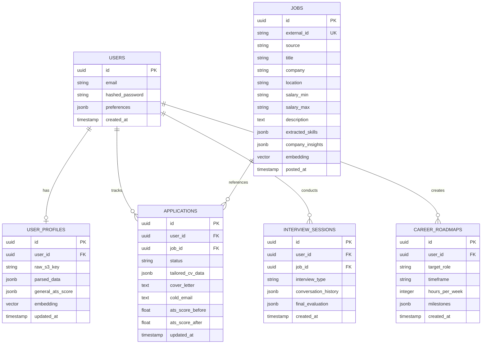

# Career Copilot: Database Schema & Data Models

Comprehensive PostgreSQL + `pgvector` schema definition and ERD for **Career Copilot**.

---

## 1. Entity Relationship Diagram (ERD)



---

## 2. Table Definitions & SQL DDL

### 1. `users`
```sql
CREATE TABLE users (
    id UUID PRIMARY KEY DEFAULT gen_random_uuid(),
    email VARCHAR(255) UNIQUE NOT NULL,
    hashed_password VARCHAR(255) NOT NULL,
    preferences JSONB DEFAULT '{"theme": "system", "default_country": "gb", "default_export_format": "pdf"}'::jsonb,
    created_at TIMESTAMP WITH TIME ZONE DEFAULT CURRENT_TIMESTAMP
);
```

### 2. `user_profiles` (Single Active CV Policy)
```sql
CREATE TABLE user_profiles (
    id UUID PRIMARY KEY DEFAULT gen_random_uuid(),
    user_id UUID UNIQUE NOT NULL REFERENCES users(id) ON DELETE CASCADE,
    raw_storage_key VARCHAR(512),
    raw_file_name VARCHAR(255),
    parsed_data JSONB NOT NULL,
    general_ats_score JSONB NOT NULL,
    embedding VECTOR(384),
    updated_at TIMESTAMP WITH TIME ZONE DEFAULT CURRENT_TIMESTAMP
);
```

### 3. `jobs` (Deduplicated Job Catalog & Insights Cache)
```sql
CREATE TABLE jobs (
    id UUID PRIMARY KEY DEFAULT gen_random_uuid(),
    external_id VARCHAR(255) UNIQUE,
    source VARCHAR(50) DEFAULT 'adzuna',
    title VARCHAR(255) NOT NULL,
    company VARCHAR(255) NOT NULL,
    location VARCHAR(255),
    salary_min NUMERIC,
    salary_max NUMERIC,
    redirect_url TEXT,
    description TEXT NOT NULL,
    extracted_skills JSONB,
    company_insights JSONB,
    embedding VECTOR(384),
    posted_at TIMESTAMP WITH TIME ZONE,
    created_at TIMESTAMP WITH TIME ZONE DEFAULT CURRENT_TIMESTAMP
);
```

### 4. `applications` (Mini-CRM Application State)
```sql
CREATE TABLE applications (
    id UUID PRIMARY KEY DEFAULT gen_random_uuid(),
    user_id UUID NOT NULL REFERENCES users(id) ON DELETE CASCADE,
    job_id UUID NOT NULL REFERENCES jobs(id) ON DELETE CASCADE,
    status VARCHAR(50) DEFAULT 'Saved', -- 'Saved', 'Tailored', 'Applied', 'Interviewing', 'Offered', 'Rejected'
    tailored_cv_data JSONB,
    cover_letter TEXT,
    cold_email TEXT,
    ats_score_before NUMERIC,
    ats_score_after NUMERIC,
    notes TEXT,
    created_at TIMESTAMP WITH TIME ZONE DEFAULT CURRENT_TIMESTAMP,
    updated_at TIMESTAMP WITH TIME ZONE DEFAULT CURRENT_TIMESTAMP,
    UNIQUE(user_id, job_id)
);
```

### 5. `interview_sessions` (Mock Interview Checkpoints)
```sql
CREATE TABLE interview_sessions (
    id UUID PRIMARY KEY DEFAULT gen_random_uuid(),
    user_id UUID NOT NULL REFERENCES users(id) ON DELETE CASCADE,
    job_id UUID REFERENCES jobs(id) ON DELETE SET NULL,
    interview_type VARCHAR(50) NOT NULL, -- 'General', 'Technical', 'Behavioral'
    conversation_history JSONB NOT NULL DEFAULT '[]'::jsonb,
    final_evaluation JSONB,
    created_at TIMESTAMP WITH TIME ZONE DEFAULT CURRENT_TIMESTAMP
);
```

### 6. `career_roadmaps` (Market Roadmaps with Study Budget)
```sql
CREATE TABLE career_roadmaps (
    id UUID PRIMARY KEY DEFAULT gen_random_uuid(),
    user_id UUID NOT NULL REFERENCES users(id) ON DELETE CASCADE,
    target_role VARCHAR(255) NOT NULL,
    timeframe VARCHAR(50) NOT NULL,
    hours_per_week INTEGER NOT NULL DEFAULT 10,
    milestones JSONB NOT NULL,
    created_at TIMESTAMP WITH TIME ZONE DEFAULT CURRENT_TIMESTAMP
);
```
