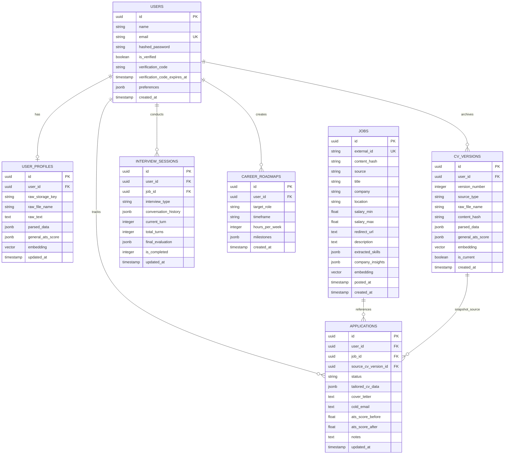

# Career Copilot: Database Schema & Data Models

Comprehensive PostgreSQL + `pgvector` schema definition, Entity Relationship Diagram (ERD), and table schemas for **Career Copilot**.

---

## 1. Entity Relationship Diagram (ERD)



---

## 2. Table Definitions & SQL DDL

### 1. `users` (User Authentication & OTP Lifecycle)
```sql
CREATE TABLE users (
    id UUID PRIMARY KEY DEFAULT gen_random_uuid(),
    name VARCHAR(255),
    email VARCHAR(255) UNIQUE NOT NULL,
    hashed_password VARCHAR(255) NOT NULL,
    is_verified BOOLEAN DEFAULT FALSE NOT NULL,
    verification_code VARCHAR(10),
    verification_code_expires_at TIMESTAMP WITH TIME ZONE,
    preferences JSONB DEFAULT '{"theme": "system", "default_country": "gb", "default_export_format": "pdf"}'::jsonb NOT NULL,
    created_at TIMESTAMP WITH TIME ZONE DEFAULT CURRENT_TIMESTAMP
);
```

### 2. `user_profiles` (Single Active CV Policy)
```sql
CREATE TABLE user_profiles (
    id UUID PRIMARY KEY DEFAULT gen_random_uuid(),
    user_id UUID UNIQUE NOT NULL REFERENCES users(id) ON DELETE CASCADE,
    raw_storage_key VARCHAR(512),
    raw_file_name VARCHAR(255),
    raw_text TEXT,
    parsed_data JSONB NOT NULL DEFAULT '{}'::jsonb,
    general_ats_score JSONB NOT NULL DEFAULT '{}'::jsonb,
    embedding VECTOR(384),
    updated_at TIMESTAMP WITH TIME ZONE DEFAULT CURRENT_TIMESTAMP
);
```

### 3. `cv_versions` (Immutable Versioned Resume Snapshots)
```sql
CREATE TABLE cv_versions (
    id UUID PRIMARY KEY DEFAULT gen_random_uuid(),
    user_id UUID NOT NULL REFERENCES users(id) ON DELETE CASCADE,
    version_number INTEGER NOT NULL,
    source_type VARCHAR(32) NOT NULL DEFAULT 'unknown',
    raw_storage_key VARCHAR(512),
    raw_file_name VARCHAR(255),
    raw_text TEXT,
    content_hash VARCHAR(64) NOT NULL,
    parsed_data JSONB NOT NULL DEFAULT '{}'::jsonb,
    parse_confidence VARCHAR(20) NOT NULL DEFAULT 'unknown',
    document_readiness_result JSONB NOT NULL DEFAULT '{}'::jsonb,
    resume_quality_result JSONB NOT NULL DEFAULT '{}'::jsonb,
    embedding VECTOR(384),
    scoring_engine_version VARCHAR(64) NOT NULL DEFAULT 'legacy',
    change_summary JSONB NOT NULL DEFAULT '{}'::jsonb,
    is_current BOOLEAN NOT NULL DEFAULT FALSE,
    is_pinned BOOLEAN NOT NULL DEFAULT FALSE,
    created_at TIMESTAMP WITH TIME ZONE DEFAULT CURRENT_TIMESTAMP NOT NULL,
    CONSTRAINT uq_cv_version_user_number UNIQUE (user_id, version_number)
);
```

### 4. `jobs` (Deduplicated Job Catalog & Insights Cache)
```sql
CREATE TABLE jobs (
    id UUID PRIMARY KEY DEFAULT gen_random_uuid(),
    external_id VARCHAR(255) UNIQUE,
    content_hash VARCHAR(64),
    source VARCHAR(50) DEFAULT 'adzuna',
    title VARCHAR(255) NOT NULL,
    company VARCHAR(255) NOT NULL,
    location VARCHAR(255),
    salary_min NUMERIC,
    salary_max NUMERIC,
    redirect_url TEXT,
    description TEXT NOT NULL,
    extracted_skills JSONB DEFAULT '{}'::jsonb,
    company_insights JSONB,
    embedding VECTOR(384),
    posted_at TIMESTAMP WITH TIME ZONE,
    created_at TIMESTAMP WITH TIME ZONE DEFAULT CURRENT_TIMESTAMP
);
```

### 5. `applications` (Mini-CRM Application State & Tailored Assets)
```sql
CREATE TABLE applications (
    id UUID PRIMARY KEY DEFAULT gen_random_uuid(),
    user_id UUID NOT NULL REFERENCES users(id) ON DELETE CASCADE,
    job_id UUID NOT NULL REFERENCES jobs(id) ON DELETE CASCADE,
    status VARCHAR(50) DEFAULT 'Saved' NOT NULL, -- 'Saved', 'Tailored', 'Applied', 'Interviewing', 'Offered', 'Rejected'
    tailored_cv_data JSONB,
    cover_letter TEXT,
    cold_email TEXT,
    ats_score_before NUMERIC,
    ats_score_after NUMERIC,
    notes TEXT,
    source_cv_version_id UUID REFERENCES cv_versions(id) ON DELETE SET NULL,
    source_evidence_snapshot JSONB,
    created_at TIMESTAMP WITH TIME ZONE DEFAULT CURRENT_TIMESTAMP,
    updated_at TIMESTAMP WITH TIME ZONE DEFAULT CURRENT_TIMESTAMP,
    CONSTRAINT uq_user_job_application UNIQUE(user_id, job_id)
);
```

### 6. `interview_sessions` (Mock Interview Checkpoints & STAR Scorecards)
```sql
CREATE TABLE interview_sessions (
    id UUID PRIMARY KEY DEFAULT gen_random_uuid(),
    user_id UUID NOT NULL REFERENCES users(id) ON DELETE CASCADE,
    job_id UUID REFERENCES jobs(id) ON DELETE SET NULL,
    interview_type VARCHAR(50) NOT NULL, -- 'General', 'Technical', 'Behavioral'
    conversation_history JSONB NOT NULL DEFAULT '[]'::jsonb,
    current_turn INTEGER DEFAULT 0,
    total_turns INTEGER DEFAULT 5,
    final_evaluation JSONB,
    is_completed INTEGER DEFAULT 0, -- 0 = active, 1 = completed
    created_at TIMESTAMP WITH TIME ZONE DEFAULT CURRENT_TIMESTAMP,
    updated_at TIMESTAMP WITH TIME ZONE DEFAULT CURRENT_TIMESTAMP
);
```

### 7. `career_roadmaps` (Market Roadmaps with Study Budget)
```sql
CREATE TABLE career_roadmaps (
    id UUID PRIMARY KEY DEFAULT gen_random_uuid(),
    user_id UUID NOT NULL REFERENCES users(id) ON DELETE CASCADE,
    target_role VARCHAR(255) NOT NULL,
    timeframe VARCHAR(50) NOT NULL,
    hours_per_week INTEGER NOT NULL DEFAULT 10,
    milestones JSONB NOT NULL DEFAULT '[]'::jsonb,
    created_at TIMESTAMP WITH TIME ZONE DEFAULT CURRENT_TIMESTAMP
);
```

