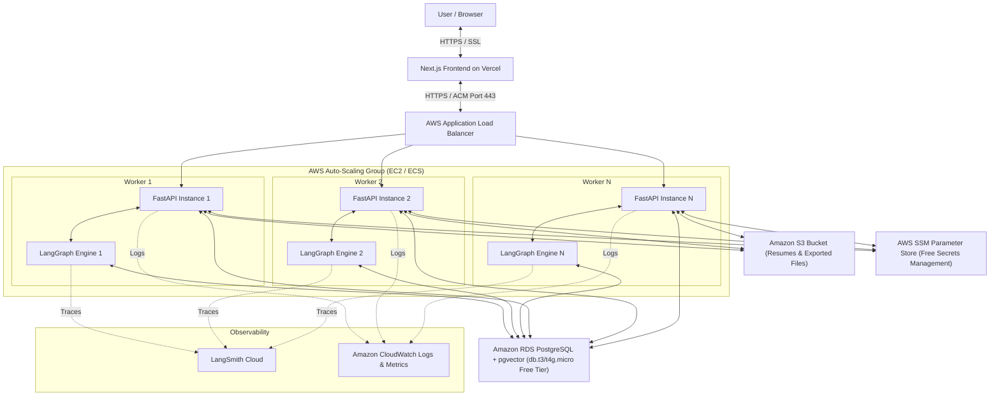
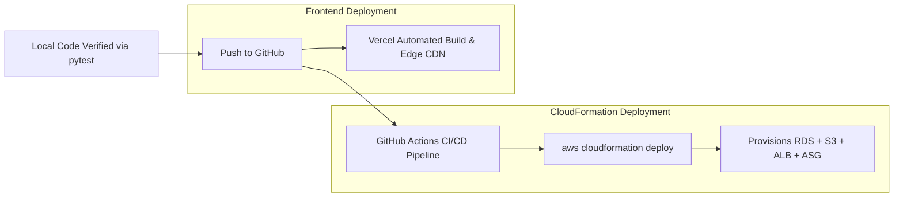

# Career Copilot: Cloud Deployment & IaC Plan (AWS & Vercel)

A comprehensive guide for containerizing, provisioning via **AWS CloudFormation (100% Free IaC)**, and deploying the **Career Copilot** application to AWS and Vercel with high availability, auto-scaling, HTTPS, and stateless backend execution.

---

## 1. Cloud Architecture Overview



---

## 2. Infrastructure Components (AWS Free-Tier & Migration Stack)

| Component | AWS Service / Tool | Configuration & Role | Free Tier Coverage |
| :--- | :--- | :--- | :--- |
| **Infrastructure as Code** | **AWS CloudFormation** | Declarative YAML/JSON stack provisioning the entire VPC, ALB, ASG, RDS, and IAM. | **100% Free** (Zero AWS charge for stack orchestration) |
| **Secret Management** | **AWS SSM Parameter Store** | Securely inject API keys (Groq GROQ_API_KEY_1..4, RapidAPI, Tavily, LangSmith, DB URLs) into EC2 workers. | **100% Free** (Standard parameters are free) |
| **Frontend Hosting** | **Vercel** | Next.js App Router edge hosting + automated preview deployments. | **100% Free** (Hobby Plan) |
| **SSL & Load Balancer** | **AWS ACM + ALB** | Port 443 HTTPS listener with free AWS Certificate Manager SSL certificate. | ACM is free; ALB covered in 750 free hrs/mo |
| **Compute & Auto-Scaling** | **AWS EC2 (ASG)** | Auto-Scaling Group (`t4g.small` or `t3.micro`) running Dockerized FastAPI. | 750 free hours/month |
| **Database & Vectors** | **AWS RDS PostgreSQL** | PostgreSQL 16 with `pgvector` enabled (`db.t3.micro` / `db.t4g.micro`). | 750 free hours/month + 20 GB SSD |
| **Document Storage** | **AWS S3** | Standard encrypted bucket for active CVs and generated PDF/DOCX files. | 5 GB free storage + 20,000 GETs |
| **Continuous Integration** | **GitHub Actions** | Automated testing, Docker image build, and CloudFormation stack rollout. | 2,000 free CI/CD build minutes/month |

---

## 3. Declarative Infrastructure as Code (CloudFormation Template)

Below is the declarative CloudFormation template skeleton (`cloudformation.yaml`) to provision the entire cloud stack in a single command:

```yaml
AWSTemplateFormatVersion: '2010-09-09'
Description: 'Career Copilot - Free-Tier Production Infrastructure Stack'

Parameters:
  DBPassword:
    Type: String
    NoEcho: true
    Description: 'Master password for PostgreSQL database'
  DomainCertificateArn:
    Type: String
    Description: 'ARN of the SSL Certificate from AWS Certificate Manager (ACM)'

Resources:
  # 1. Secure Storage for Resumes & Exports
  ResumeStorageBucket:
    Type: AWS::S3::Bucket
    Properties:
      BucketName: !Sub 'career-copilot-storage-${AWS::AccountId}'
      BucketEncryption:
        ServerSideEncryptionConfiguration:
          - ServerSideEncryptionByDefault:
              SSEAlgorithm: AES256
      PublicAccessBlockConfiguration:
        BlockPublicAcls: true
        BlockPublicPolicy: true
        IgnorePublicAcls: true
        RestrictPublicBuckets: true

  # 2. Database: RDS PostgreSQL with pgvector (Free-Tier Eligible)
  DatabaseInstance:
    Type: AWS::RDS::DBInstance
    Properties:
      DBInstanceIdentifier: 'career-copilot-db'
      Engine: postgres
      EngineVersion: '16.3'
      DBInstanceClass: db.t4g.micro
      AllocatedStorage: '20'
      MasterUsername: postgres
      MasterUserPassword: !Ref DBPassword
      DBName: career_copilot
      PubliclyAccessible: false
      DeleteAutomatedBackups: false

  # 3. Application Load Balancer with HTTPS
  AppLoadBalancer:
    Type: AWS::ElasticLoadBalancingV2::LoadBalancer
    Properties:
      Name: 'career-copilot-alb'
      Scheme: internet-facing
      Type: application

  # 4. HTTPS Listener (Port 443) with ACM Certificate
  HttpsListener:
    Type: AWS::ElasticLoadBalancingV2::Listener
    Properties:
      LoadBalancerArn: !Ref AppLoadBalancer
      Port: 443
      Protocol: HTTPS
      Certificates:
        - CertificateArn: !Ref DomainCertificateArn
      DefaultActions:
        - Type: forward
          TargetGroupArn: !Ref BackendTargetGroup

  # 5. HTTP to HTTPS Auto-Redirect (Port 80 -> 443)
  HttpRedirectListener:
    Type: AWS::ElasticLoadBalancingV2::Listener
    Properties:
      LoadBalancerArn: !Ref AppLoadBalancer
      Port: 80
      Protocol: HTTP
      DefaultActions:
        - Type: redirect
          RedirectConfig:
            Protocol: HTTPS
            Port: '443'
            StatusCode: HTTP_301

  # 6. Target Group with Health Check
  BackendTargetGroup:
    Type: AWS::ElasticLoadBalancingV2::TargetGroup
    Properties:
      Name: 'career-copilot-tg'
      Port: 8000
      Protocol: HTTP
      HealthCheckPath: '/health'
      HealthCheckIntervalSeconds: 30
      TargetType: instance
```

---

## 4. Migration & Deployment Steps



### 1. One-Click Stack Deployment:
```bash
aws cloudformation deploy \
  --template-file cloudformation.yaml \
  --stack-name career-copilot-prod \
  --parameter-overrides DBPassword=MySecurePassword123! DomainCertificateArn=arn:aws:acm:... \
  --capabilities CAPABILITY_IAM
```

### 2. Zero-Downtime Rolling Update:
When a new Docker image is pushed to AWS ECR, the Auto-Scaling Group performs a rolling instance refresh (`aws autoscaling start-instance-refresh`), updating each worker instance sequentially with zero user downtime.
