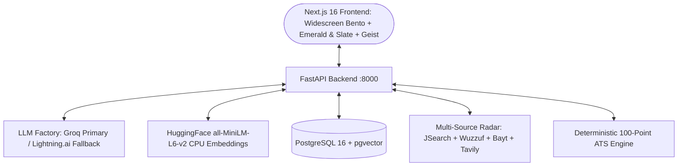

# Career Copilot — Architecture & Implementation Blueprint

## 1. System Architecture & Tech Stack

Career Copilot is an end-to-end multi-agent AI system built for job discovery, ATS readiness auditing, truthful resume tailoring, stateful mock interviews, and feasibility-verified career roadmaps.



### Core Technologies:
* **Backend:** Python 3.12, FastAPI, SQLAlchemy 2.0, Pydantic v2, `uv` package manager.
* **Authentication & Security:** bcrypt password hashing, 6-digit email OTP verification codes with 10-minute TTL, signed stateless JWT tokens.
* **LLM Engine:** Groq primary (`openai/gpt-oss-120b`, `openai/gpt-oss-20b`) with automatic failover to Lightning.ai (`lightning-ai/gpt-oss-120b`) via LangChain `.with_fallbacks()`.
* **Embeddings:** Free local HuggingFace `sentence-transformers/all-MiniLM-L6-v2` (384 dimensions, CPU-optimized for AWS Free Tier).
* **Database & Vector Store:** PostgreSQL 16 with `pgvector` extension.
* **Search & Intelligence:** Multi-source MENA & Global engine (RapidAPI JSearch for LinkedIn/Indeed, Wuzzuf & Bayt scrapers, and Tavily live search fallback) with auto-cached company intelligence.
* **Frontend:** Next.js 16 (App Router), React 19, TypeScript, TailwindCSS, Lucide Icons, Vercel Geist fonts, and `next-themes` (Light/Dark/System modes) on an expansive widescreen layout (`max-w-[1600px]`).

---

## 2. Multi-Agent Workflows & Critic Loops

### Module 01: CV Diagnostics & Deterministic ATS Scoring
* **Input:** Multipart file upload (PDF/DOCX) or raw text paste with live architectural scanning.
* **Single Active CV Policy:** Overwrites and purges previous files from storage and vector store upon new upload.
* **OCR Fallback:** `pytesseract` automatically processes scanned pages yielding $<50$ characters.
* **Dual Context Modes:**
  1. *Targeted Job Fit:* Evaluates candidate CV directly against a specific Job Description.
  2. *General CV Health:* 5-metric weighted model: Parseability (30%), Action Language (25%), Quantification (20%), Contact Hygiene (15%), Brevity & Formatting (10%).

### Module 02: Market Research & 5-Factor Job Matching
* **Concurrent Ingestion ($0 Cost):**
  * *Wuzzuf Scraper:* Direct HTML extraction of Egyptian technical roles.
  * *Bayt Scraper:* Direct HTML extraction of Egypt & Gulf opportunities.
  * *RapidAPI JSearch Client:* Queries live **LinkedIn** and **Indeed** listings (200 free monthly requests).
* **Universal Dynamic Backfill:** Tavily live web search queries `linkedin.com`, `wuzzuf.net`, and `bayt.com` if fewer than 15 jobs are collected, guaranteeing 15–20 distinct opportunities.
* **Anti-Aggregator Quality Gate:** Rejects search directories and aggregator links (`job_quality.py`).
* **5-Factor Match Model:**
  $$\text{Total Match Score} = (0.40 \times \text{Hard Skills}) + (0.25 \times \text{Semantic NLP}) + (0.15 \times \text{Title}) + (0.10 \times \text{Years}) + (0.10 \times \text{Soft Skills})$$

### Module 03: Application Studio with Fact Critic Reflection Loop
* **Full Resume Integrity:** Generates complete tailored CV preserving contact information, education, and certifications while tailoring professional summary, technical skills, and experience bullets. Generates targeted cover letters and 3-paragraph cold outreach emails.
* **Company Insights Integration:** Checks PostgreSQL first; auto-fetches via Tavily if absent and caches in DB.
* **Fact & Anti-Hallucination Critic Node:** Validates tailored bullets against original CV. Rejects unverified skills, degrees, or companies (up to 3 total attempts).
* **ATS Gap Delta:** Computes Before vs. After ATS match score.
* **Document Exports:** One-click downloads for Word (`.docx`) CV, Word (`.docx`) Cover Letter, and Plain Text (`.txt`) Email.

### Module 04: 6-Stage Mini-CRM Kanban Pipeline
* **Stages:** Saved, Tailored, Applied, Interviewing, Offered, Rejected.
* **Opportunity Drawer:** View tailored assets, download DOCX files, update application stage, or re-run tailoring.

### Module 05: Stateful Mock Interview Simulator
* **Modes:**
  * *General:* Custom domain/field specification.
  * *Technical:* Probes technical depth and system design against selected Mini-CRM opportunities + active CV + company intelligence.
  * *Behavioral:* Evaluates candidate responses against the STAR framework in the context of target Mini-CRM job + active CV + company culture values.
* **State Machine:** Multi-turn conversation tracking with immediate per-turn micro-feedback.
* **Scorecard & Session Management:** Overall score (0–100), STAR rubric assessment, technical depth, strengths, areas for improvement, hiring recommendations, and Exit Interview button.

### Module 06: Conversational Career Roadmap Coach with Feasibility Critic
* **4-Phase Progressive Architecture:** Phase 1 (Deep Core), Phase 2 (Production Ecosystem), Phase 3 (Cloud & Infrastructure), Phase 4 (Capstone Architecture & System Design).
* **Portfolio-Driven Deliverables:** Every milestone produces a concrete, testable GitHub project deliverable.
* **Study Hours Budgeting:** Strictly balances topics based on total study hours ($Weeks \times Hours/Week$).
* **Feasibility Critic Node:** Verifies milestone sequencing and ensures workload volume is realistic for the hours budget (up to 3 attempts).
* **Relocation & Market Playbook:** Structured Markdown output with channel matrices, weekly timetables, and visa pathways.

---

## 3. Database Schema Overview

```sql
-- 7 Core Relational Models with pgvector
users (id, name, email, hashed_password, is_verified, verification_code, preferences, created_at)
user_profiles (id, user_id, raw_storage_key, raw_file_name, raw_text, parsed_data, general_ats_score, embedding vector(384))
cv_versions (id, user_id, version_number, source_type, content_hash, parsed_data, general_ats_score, embedding vector(384), is_current)
jobs (id, external_id, content_hash, source, title, company, location, salary_min, salary_max, description, company_insights, embedding vector(384))
applications (id, user_id, job_id, status, tailored_cv_data, cover_letter, cold_email, ats_score_before, ats_score_after, notes)
interview_sessions (id, user_id, job_id, interview_type, conversation_history, current_turn, total_turns, final_evaluation, is_completed)
career_roadmaps (id, user_id, target_role, timeframe, hours_per_week, milestones)
```

---

## 4. Verification & Testing

The complete test suite runs via `uv run pytest`:
* `tests/test_ats_engine.py`: **PASSED**
* `tests/test_cv_parser.py`: **PASSED**
* `tests/test_cv_versions.py`: **PASSED**
* `tests/test_mena_job_search.py`: **PASSED**
* `tests/test_phase0_safety.py`: **PASSED**
* `tests/test_upgrade_v2.py`: **PASSED**

