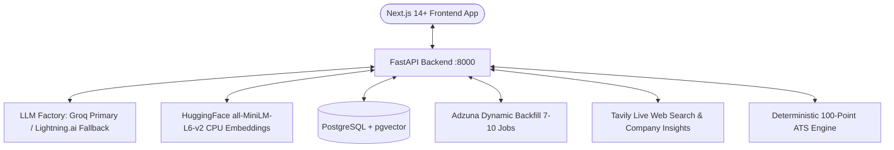

# Career Copilot — Architecture & Implementation Blueprint

## 1. System Architecture & Tech Stack

Career Copilot is an end-to-end multi-agent AI system built for job discovery, ATS readiness auditing, truthful resume tailoring, stateful mock interviews, and feasibility-verified career roadmaps.



### Core Technologies:
* **Backend:** Python 3.12, FastAPI, SQLAlchemy 2.0, Pydantic v2, `uv` package manager.
* **LLM Engine:** Groq primary (`openai/gpt-oss-120b`, `openai/gpt-oss-20b`) with automatic fallback to Lightning.ai (`openai/gpt-oss-120b`).
* **Embeddings:** Free local HuggingFace `sentence-transformers/all-MiniLM-L6-v2` (384 dimensions, CPU-optimized for AWS Free Tier).
* **Database & Vector Store:** PostgreSQL 16 with `pgvector` extension.
* **Search & Intelligence:** Adzuna API (7–10 job dynamic backfill) with Tavily live web search fallback for Egypt and international markets.
* **Frontend:** Next.js 14+ (App Router), React 19, TypeScript, TailwindCSS, Lucide Icons, `next-themes` (Light/Dark/System modes).

---

## 2. Multi-Agent Workflows & Critic Loops

### Agent 1: CV Ingestion & ATS Readiness Audit
* **Input:** Multipart file upload (PDF/DOCX) or raw text paste.
* **Single Active CV Policy:** Overwrites and purges previous files from storage and vector store upon new upload.
* **OCR Fallback:** `pytesseract` automatically processes scanned pages yielding $<50$ characters.
* **100-Point Deterministic ATS Engine:**
  1. *Contact & Section Hygiene (25 pts):* Verifies name, email, phone, location, LinkedIn/GitHub, and standard headers.
  2. *Action Verb Strength (25 pts):* Analyzes experience bullets for leading power verbs.
  3. *Quantifiable Impact (25 pts):* Measures percentages, currency, multipliers, and scale numbers.
  4. *Formatting & Skill Density (25 pts):* Evaluates word count, bullet density, and technical skill breadth.

### Agent 2: Market Research & Dual-Layer Job Search
* **Query Infilling:** Inactive/blank queries are auto-infilled from candidate target role and preferences.
* **Dynamic Backfill Loop:** Guarantees 7–10 distinct jobs per query by requesting consecutive page offsets if initial filtering yields $<7$ jobs.
* **Universal Location Fallback (Egypt & Global):** If Adzuna lacks dedicated local indexes (e.g. Egypt, MENA), Tavily live web search queries LinkedIn, Wuzzuf, Bayt, and Glassdoor to deliver 7–10 active job listings.
* **Cross-Source SHA-256 Deduplication:** Computes normalized `sha256(company|title|location)` to discard duplicate postings across Adzuna and Tavily.

### Agent 3: Job Matching & Fit Ranking
* **Hybrid Fit Scoring:** Evaluates active CV against required job skills and JD text.
* **Re-sorting:** Dynamically orders search batches descending by fit percentage (`88% Match`, `75% Match`).

### Agent 4: Application Tailoring with Fact-Check Critic Loop
* **Generator Node:** Rephrases, reorders, and highlights candidate achievements matching target JD keywords without inventing facts. Generates targeted cover letters and 3-paragraph cold outreach emails.
* **Fact & Anti-Hallucination Critic Node:** Validates tailored bullets against original CV. Rejects unverified skills, degrees, or companies (up to 2 retries / 3 total attempts).
* **ATS Gap Delta:** Computes Before vs. After ATS match score.
* **Export:** One-click download as Microsoft Word (`.docx`) and clean HTML/PDF.

### Agent 5: Stateful Mock Interview Simulator
* **Modes:** *General*, *Technical* (tailored to CV + target JD), and *Behavioral* (STAR Method evaluation).
* **State Machine:** Multi-turn conversation tracking (Turns 1 to 5) with immediate micro-feedback per candidate answer.
* **Final Scorecard:** Compiles overall score (0–100), STAR rubric assessment, technical depth, strengths, areas for improvement, and hiring recommendation.

### Agent 6: Career Roadmap Planner with Feasibility Critic
* **Input Gate:** Validates that Target Role, Timeframe, AND Weekly Study Hours are provided. Missing hours halts execution and prompts user.
* **Real-time Market Trends:** Queries Tavily for in-demand technologies, frameworks, and certifications.
* **Workload Budgeting:** Allocates topics realistically based on total study hours ($Weeks \times Hours/Week$).
* **Feasibility Critic Node:** Verifies milestone sequencing and ensures workload volume is realistic for the hours budget (up to 2 retries / 3 attempts).

---

## 3. Database Schema Overview

```sql
-- 6 Core Tables
users (id, email, hashed_password, preferences, created_at, updated_at)
user_profiles (id, user_id, raw_storage_key, raw_text, parsed_data, general_ats_score, embedding vector(384))
jobs (id, external_id, content_hash, source, title, company, location, salary_min, salary_max, description, company_insights, embedding vector(384))
applications (id, user_id, job_id, status, tailored_cv_data, cover_letter, cold_email, ats_score_before, ats_score_after, notes)
interview_sessions (id, user_id, job_id, interview_type, conversation_history, current_turn, total_turns, final_evaluation, is_completed)
career_roadmaps (id, user_id, target_role, timeframe, hours_per_week, milestones)
```

---

## 4. Verification & Testing

The complete test suite runs via `uv run pytest`:
* `test_job_content_hash_consistency`: **PASSED**
* `test_dynamic_backfill_pagination_mock`: **PASSED**
* `test_general_ats_score_high_quality_cv`: **PASSED**
* `test_general_ats_score_missing_contact_and_weak_verbs`: **PASSED**
* `test_job_specific_ats_match`: **PASSED**
* `test_sanitize_text`: **PASSED**
* `test_parse_plain_text_cv`: **PASSED**
* `test_real_cv_parsing_pdf`: **PASSED**
* `test_real_cv_parsing_docx`: **PASSED**
* `test_full_ats_audit_on_real_cv`: **PASSED**
